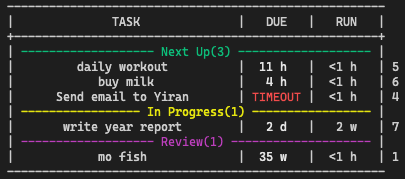

# tds

[](https://crates.io/crates/tds)

A tool to manage to-do items.



## Feature

### I. Update task status anywhere 🌍

#### *1 - user, N - devices*

Because the data is stored in your own database, it can be reached synchronously on any device.

### II. Assign / Receive ToDo with other 👬

#### *N - users, N - devices*

Configure multiple users to connect to the same database, each user can edit and modify their own tasks without interfering with each other. You can even assign tasks to others, similar to Trello.

### III. Sync with GitLab / GitHub 📦

You can synchronize tasks on gitlab to tds, and even submit changes to gitlab.

### IV. Customization 🎨

You can easily configure your favorite window style.

## Install

### 0. vi ~/.config/tds/tds.toml

```toml
db_host = "127.0.0.1"
db_port = "5432"
db_user = "iiran"
db_password = "iiran"
db_database = "iiran"
user = "iiran"
email = "percivalstr@163.com"
gitlab_user = ""
gitlab_ac_token = ""
```

### 1. Install by Cargo

```bash
cargo install tds
tds --init
```

## How to use

```bash
USAGE:
tds [COMMAND] [OPTION]

COMMAND:
l --list,                           List all todo status.
i --inspect <ID>                    Check todo.
a --add  <title> <due>              Create new todo.
s --set <ID> <state>                Update todo status.
d --del <ID>                        Delete todo.
v --visual                          Visual Mode.
p --pull  <host>                    Pull ToDo from gitlab / github.
```

### Example

#### 1. Create New task

```bash
# create task named 'reply email', should be solved in 2 hours.
tds a 'reply email' 2hours
```

#### 2. Update task state

```bash
# mark task is cmpleted which id is 1.
tds s 1 c
```
